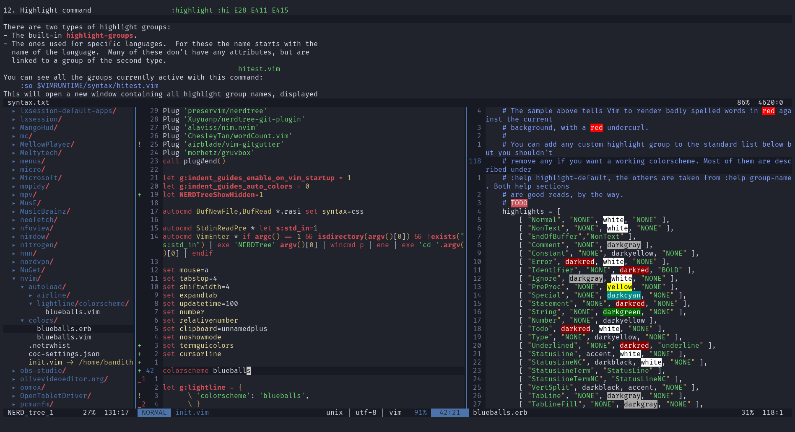

# blueballs.vim

Port of the [blueballs](https://github.com/bandithedoge/blueballs) color scheme for Vim and Lightline.

# Installation

* [vim-plug](https://github.com/junegunn/vim-plug)
  * Add `Plug 'bandithedoge/blueballs.vim'` to your `.vimrc` and run `:PlugInstall`
